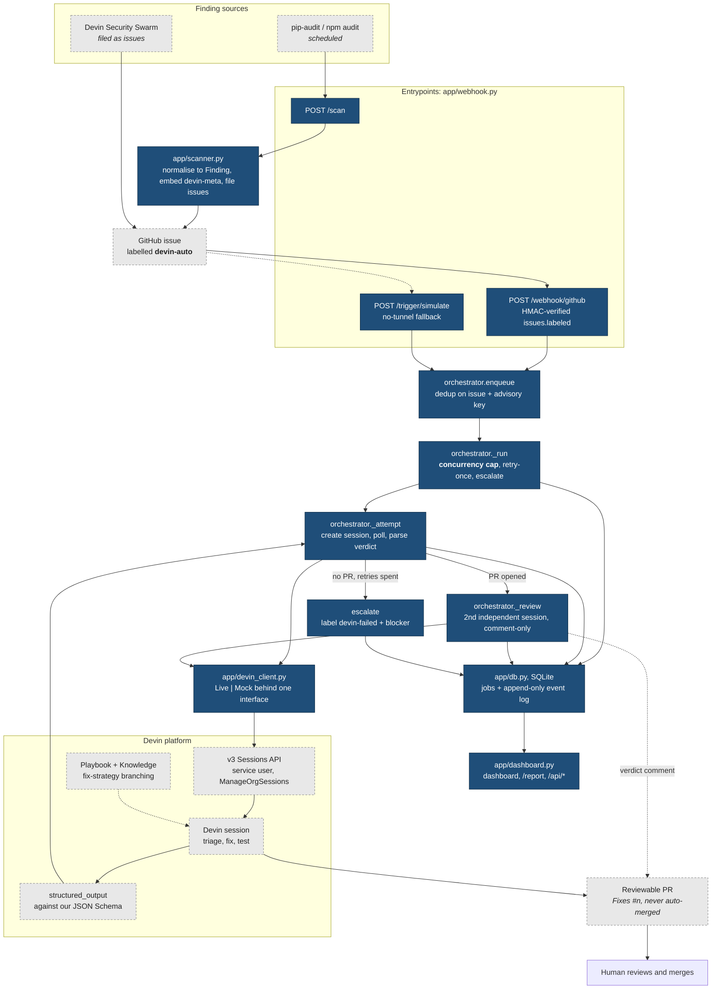
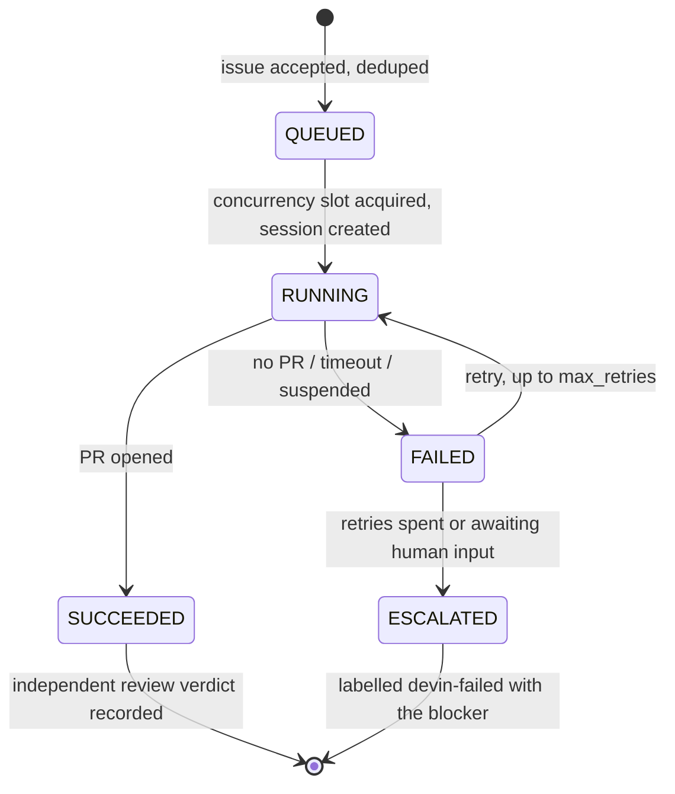
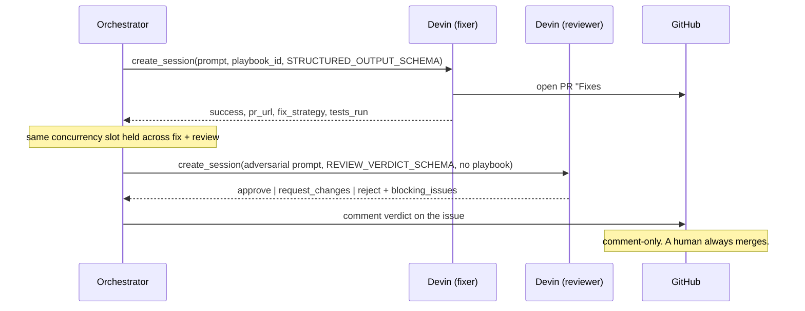

# Architecture

What this system is: a governed orchestration layer around Devin. Devin does the
remediation. Our code decides *which* findings Devin gets, *under what limits*, and
*how a leader knows it worked*.

Blue = code in this repo. Grey, dashed = Devin / GitHub native capability we configure
rather than rebuild.

## System flow

## Job lifecycle

A finding sits in `QUEUED` with **no session created** while the semaphore is full, so a
large backlog cannot spike cost or blast radius.

## The two-session governance loop

The reviewer did not write the PR, gets no Playbook, and is prompted to be adversarial.
`AUTO_MERGE_ON_APPROVE` defaults to false and even when enabled only *records* a
would-merge decision.

## Custom vs native

| Concern | Whose |
|---|---|
| Remediation itself: triage, fix, test | Devin |
| Procedure and conventions | Devin Playbook + Knowledge, authored by us |
| Machine-readable verdict | Devin structured output, **our** JSON Schema |
| Which findings get a session, and when | Custom |
| Concurrency cap, retry-once, escalation | Custom |
| Independent review gate wiring | Custom |
| Job state, event timeline, leader metrics | Custom |
| Live/replay parity behind one interface | Custom |

## File map

| Path | Lines | Role |
|---|---|---|
| `app/orchestrator.py` | 422 | Session lifecycle, governance, review gate |
| `app/dashboard.py` | 385 | Metrics API, dashboard, `/report` |
| `app/scanner.py` | 215 | pip-audit / npm audit to `devin-auto` issues |
| `app/devin_client.py` | 209 | v3 client + deterministic replay fake |
| `app/db.py` | 157 | SQLite jobs + event log, self-healing migration |
| `app/models.py` | 144 | `Job` / `Finding`, state machine, both JSON Schemas |
| `app/github_client.py` | 84 | Issue create / comment / label |
| `app/webhook.py` | 76 | Three triggers |
| `app/config.py` | 69 | Caps and feature flags |
| `playbooks/security-remediation.md` | 63 | The procedure, as code |
| `scripts/seed_demo.py` | 73 | Replay driver, no keys needed |
| `scripts/reconcile.py` | 52 | Resolve orphaned RUNNING jobs |

~2,040 lines total, plus 23 tests.
